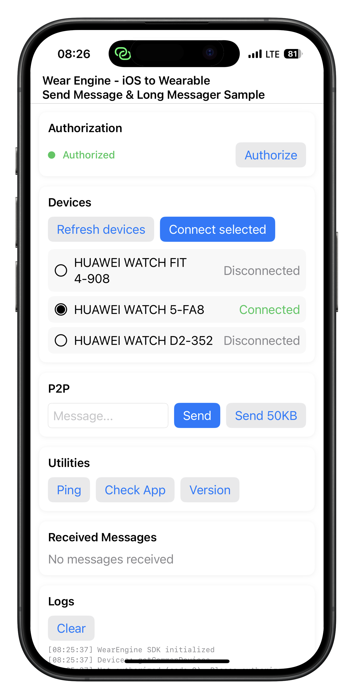
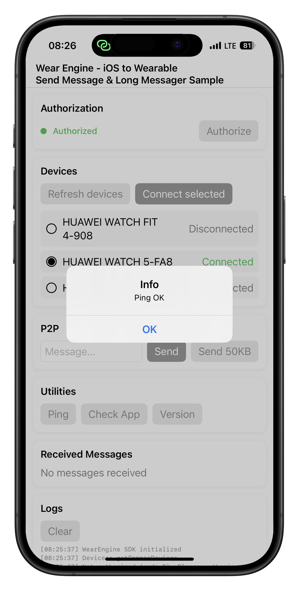
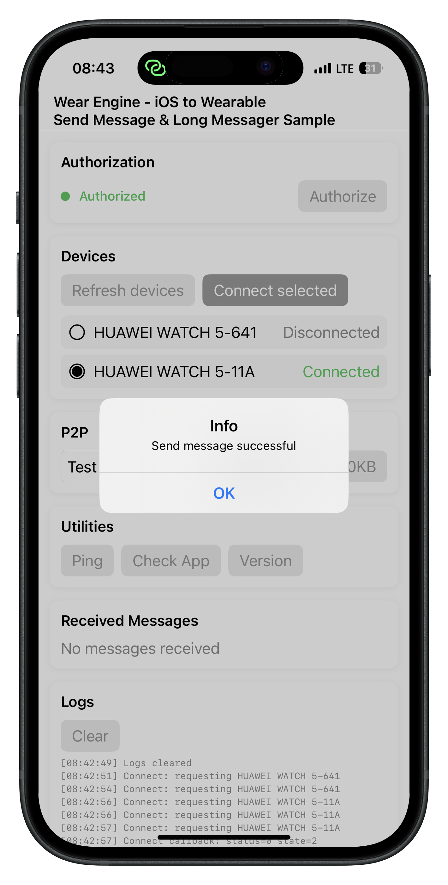
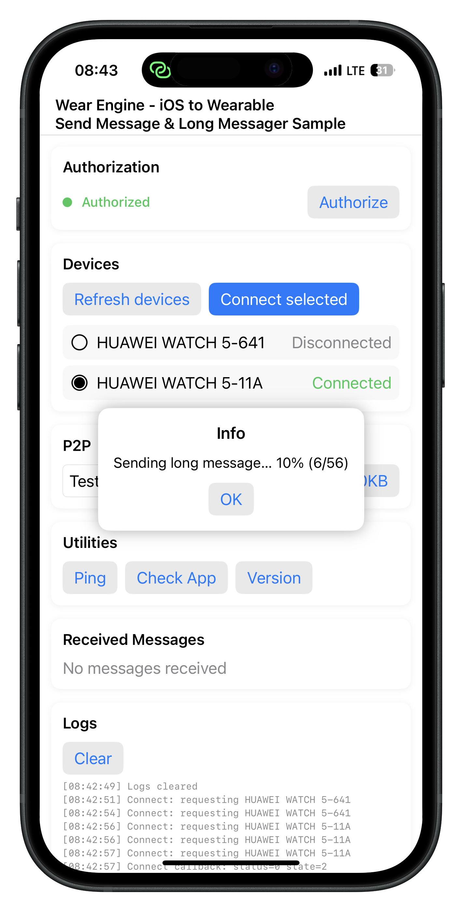

> **Note:** To access all shared projects, get information about environment setup, and view other guides, please visit [Explore-In-HMOS-Wearable Index](https://github.com/Explore-In-HMOS-Wearable/hmos-index).

# [Mobile(iOS) to Watch] Wear Engine - Messaging & Receiver Sample

iOS P2P Communication Demo using Huawei Wear Engine SDK secure peer-to-peer communication between an iOS app and Huawei wearables.  
Demonstrates message transmission, app reachability checks (ping, installation check, version check), and device management using the Wear Engine iOS SDK.

# Preview
<div>
  
  
  
  
</div>

# Use Cases
- Send secure messages between phone and watch
- Bi-directional messaging via receiver registration
- Verify if a watch app is installed and retrieve its version
- Ping the target app to test reachability
- Automatic device discovery for paired wearables
- Authorization and connection management

# Technology

## Stack
- Languages: Swift, SwiftUI
- Frameworks/SDK: Huawei Wear Engine iOS SDK
- Tools: Xcode, Swift Package Manager

## Required Permissions
- Download wear engine sdk - [Wear engine SDK](https://developer.huawei.com/consumer/en/doc/connectivity-Library/phone-sdk-cn-0000001656844234)
- Integrate the Wear Engine SDK on your project 
 - [Integrate Wear Engine SDK](https://developer.huawei.com/consumer/en/doc/connectivity-Guides/integrated-sdk-ios-0000001921071177)
- [Wear engine application (iOS)](https://developer.huawei.com/consumer/en/doc/connectivity-Guides/applying-wearengine-ios-0000001935664117)
- AppGallery Connect: Client ID, Client Secret, Scheme Secret configured for your iOS bundle ID
- iOS URL Scheme for OAuth callback (Info.plist → URL Types)
- Huawei Health app installed on the phone and paired with the wearable
- Proper source/destination identity configuration:
  - `srcPkgName`, `srcFingerprint` (your iOS app identity registered in AppGallery)
  - `destPkgName`, `destFingerprint` (watch app identity; for Smart Next devices like Watch 5 use appID, for lite/smart wearable series like GT/Fit/D/Ultimate/Watch4/3 follow signature/appID rules in Huawei docs)

# Directory Structure

```
│   AppDelegate.swift
│   Info.plist
│   SceneDelegate.swift
│   ServiceLocator.swift
│   ViewController.swift
│
├───Assets.xcassets
│   │   Contents.json
│   │
│   ├───AccentColor.colorset
│   │       Contents.json
│   │
│   └───AppIcon.appiconset
│           Contents.json
│
├───Base.lproj
│       LaunchScreen.storyboard
│       Main.storyboard
│
├───managers
│       WearEngineManager.swift
│
├───models
│       WearEngineModels.swift
│
├───viewmodels
│       WearEngineViewModels.swift
│
└───views
    │   WearEngineView.swift
    │
    └───components
            UIComponents.swift
```

# Constraints and Restrictions

## Supported Devices
- iOS (iPhone)
- Huawei wearables paired via Huawei Health

## Requirements
- Request access to the Wear Engine Service (AppGallery Connect)
- Huawei Health app installed on the phone
- Wear Engine iOS SDK integrated
- Paired Huawei wearable device
- Proper identity configuration (src/dest package and fingerprint/appID)
- Real device testing (iOS Simulator is not supported for Wear Engine connectivity)

## Quick Start

### 1) Configure  in WearEngineManager
Set these values inside `WearEngineManager`:
- `clientId`, `clientSecret`, `schemeSecret`, `authCallbackScheme` your wear engine apply information
- `srcPkgName`, `srcFingerprint` (iOS app identity)
- `destPkgName`, `destFingerprint` (watch app identity)

### 2) Add URL Scheme (OAuth callback)
Add your `authCallbackScheme` under Info.plist → URL Types, and forward the callback:
```    
    <array>
        <dict>
            <key>CFBundleTypeRole</key>
            <string>Editor</string>
            <key>CFBundleURLName</key>
            <string>YOUR SHEME URL</string>
            <key>CFBundleURLSchemes</key>
            <array>
                <string>YOUR SHEME</string>
            </array>
        </dict>
    </array>
```
### Notes and Tips
- If getCommonDevices returns empty, ensure Huawei Health is installed and the wearable is paired.
- Error “9” indicates authorization missing/expired; run the authorization flow again.
- Ping results:
    - Success / WatchAPPRunning: reachable
    - 200: Watch app not installed
    - 201: Watch app not running
- If sending fails, verify src/dest identities and fingerprint/appID alignment between iOS and watch app.
- iOS wear engine not supported file transfer

### P2P Communication Setup
- Sender identity: iOS → Watch (src = iOS app, dest = watch app)  
- Receiver identity: Watch → iOS (src = watch app, dest = iOS app)  
- Register a receiver after connecting to receive incoming messages.

### WearEngineManager (Swift)
- Handles authorization (OAuth) and processes callback URLs
- Discovers and lists paired Huawei wearables (`getCommonDevices`)
- Connects to a selected device and verifies current device context
- P2P operations:
  - `sendMessage` / `sendLongMessage` (chunked)
  - `registerReceiver` / `unRegisterReceiver`
  - `ping` (reachability)
  - `isAppInstalled` (check)
  - `getAppVersion` (check)
- Identity handling (sender/receiver) and payload building
- Connection safety checks for current device

### WearEngineViewModel (SwiftUI)
- Manages UI state: devices, selected device, messages, logs, alerts
- Orchestrates authorization, device refresh/selection, connect, and P2P utilities

### WearEngineView (SwiftUI)
- Sections: Authorization, Devices, P2P, Utilities, Received Messages, Logs
- Simple chat-like UI for sending text and viewing recent received messages

### Documentation Links
- [Request User Authorization (iOS)](https://developer.huawei.com/consumer/en/doc/connectivity-Guides/request-user-authorization-ios-0000001920933293)
- [Check Available Devices (iOS)](https://developer.huawei.com/consumer/en/doc/connectivity-Guides/check-availabla-dev-ios-0000001921237861)
- [Phone Send Message (iOS)](https://developer.huawei.com/consumer/en/doc/connectivity-Guides/phone-send-message-ios-0000001875158886)

# LICENSE
 [Mobile(iOS) to Watch]  Wear Engine - Messaging & Receiver Sample is distributed under the terms of the MIT License.
See the [license](/LICENSE) for more information.